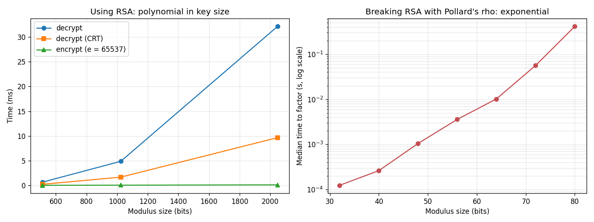

# RSA Cryptography using Group Theory

A from-scratch Python implementation of RSA, built directly on the group
theory that makes it work, with the attacks that show why key size matters
and why quantum computers break it.

It accompanies my section, "Introduction: RSA and Shor's Algorithm", of the
group report *Post-Quantum Cryptography: A Comprehensive Survey*, for
**MA2209 – Number Theory and Cryptography**, Mahindra University.

## Why RSA works: the group theory

RSA operates in the multiplicative group of units

```
G = (ℤ/nℤ)* = { a : 1 ≤ a < n, gcd(a, n) = 1 },     |G| = φ(n) = (p − 1)(q − 1)
```

By **Lagrange's theorem**, the order of every element divides |G|, so
a^φ(n) = 1 for every unit a. This is **Euler's theorem**. Key generation picks
e and d with e·d = 1 + k·φ(n), so

```
(mᵉ)ᵈ = m^(1 + kφ(n)) = m · (m^φ(n))ᵏ = m   (mod n)
```

and decryption undoes encryption. A Chinese Remainder Theorem argument extends
this to messages that share a factor with n, and the tests check it
exhaustively for n = 3233.

## What's implemented

| Module | Contents |
|---|---|
| `number_theory.py` | Euclid and extended Euclid (Bézout coefficients), modular inverse, square-and-multiply exponentiation, Miller–Rabin primality test, random prime generation, Euler's φ |
| `rsa.py` | Key generation (report §2.2), encryption and decryption (§2.3), CRT decryption, text encoding, SHA-256 signatures (§2.4) |
| `group_theory.py` | Units of ℤ/nℤ, element orders, Carmichael λ(n), cyclicity, checks of Euler's and Lagrange's theorems |
| `attacks.py` | Trial division, Pollard's rho, Fermat's method for close primes, private-key recovery from the public key (§2.5), and Shor's reduction from factoring to order finding (§3.2–3.3) |

Every algorithm is written out by hand. The code does not use Python's
built-in `pow(a, -1, n)` or a crypto library, so each line can be traced back
to the report. The tests then check these functions against Python's built-ins.

## Results

From `benchmarks/benchmark.py` (pure Python, medians):

| Modulus | Key generation | Decrypt | Decrypt with CRT |
|---|---|---|---|
| 512-bit | 0.013 s | 0.64 ms | 0.21 ms |
| 1024-bit | 0.094 s | 4.87 ms | 1.66 ms |
| 2048-bit | 0.81 s | 32.2 ms | 9.7 ms |



- **Using RSA is cheap.** Cost grows polynomially with key size.
  Square-and-multiply needs only about 3,000 multiplications for a 2048-bit exponent.
- **CRT decryption is about 3× faster.** It uses two half-size exponentiations
  instead of one full-size one.
- **Breaking RSA is exponential.** Pollard's rho factoring time doubles roughly
  every 4 bits of the modulus, matching its O(n^¼) expected cost. That is how an
  80-bit key falls in under half a second while a 2048-bit key is out of reach.
  Shor's algorithm removes this gap on a quantum computer.

## Shor's algorithm, classically

Shor factors n by finding the order r of a random a modulo n. If r is even and
a^(r/2) ≢ −1, then gcd(a^(r/2) ± 1, n) gives the factors. `attacks.py`
implements every classical step and brute-forces r, the step a quantum computer
does in polynomial time with the Quantum Fourier Transform:

```
n = 3233. Try bases a and look at the order r of a modulo n:
  a =  2: r = 780  a^(r/2) = 3232 ≡ −1 (mod n) → only trivial factors, retry
  a = 13: r =  39  r is odd → a^(r/2) undefined, retry
  a =  3: r = 260  a^(r/2) = 794; gcd(794 − 1, n) = 61, gcd(794 + 1, n) = 53
→ 3233 = 61 × 53
```

## Getting started

```bash
pip install -r requirements.txt

python demo.py               # full walkthrough with a 2048-bit key
python demo.py --bits 512    # quicker
pytest -q                    # 253 tests
python benchmarks/benchmark.py
```

The RSA code itself needs only the Python standard library. matplotlib is used
for the benchmark chart and pytest for the tests.

```python
from rsa_group import rsa

public, private = rsa.generate_keypair(2048)
c = rsa.encrypt_text("hello", public)
rsa.decrypt_text(c, private)                    # 'hello'

sig = rsa.sign(b"message", private)
rsa.verify(b"message", sig, public)             # True
```

## Testing

`tests/test_rsa.py` checks:

- **Number theory against Python's built-ins.** `gcd`, `mod_inverse` and `mod_pow`
  match `math.gcd` and `pow` on 100 random cases each.
- **Primality.** Miller–Rabin correctly classifies every number below 5,000,
  rejects Carmichael numbers (which fool Fermat's test), and handles 2¹²⁷ − 1
  and 2¹²⁸ + 1.
- **RSA itself.** Round-trips for integers, text and signatures. It also covers
  the classic textbook example (p = 61, q = 53, e = 17 gives d = 2753) and
  tampered signatures being rejected.
- **Group theory.** Euler's and Lagrange's theorems hold on ten moduli, and
  m ↦ mᵉ permutes all of ℤ/nℤ.
- **Attacks.** Pollard's rho recovers working private keys for 32–64-bit moduli,
  and Shor's reduction factors eight small semiprimes. Fermat's method breaks a
  2048-bit key whose primes are too close together, and gives up on
  well-separated ones.

## Security note

This is **textbook RSA**, written for learning. It is deterministic and
malleable: Enc(a)·Enc(b) = Enc(a·b), and a test demonstrates this. Real
systems add OAEP padding for encryption and PSS for signatures, and use
constant-time arithmetic to resist side-channel attacks. Use a vetted library
such as [`cryptography`](https://cryptography.io) for anything real.

## Repository structure

```
├── rsa_group/
│   ├── number_theory.py
│   ├── rsa.py
│   ├── group_theory.py
│   └── attacks.py
├── tests/test_rsa.py
├── benchmarks/benchmark.py
├── demo.py
├── results/                     benchmark tables, chart, demo output
└── reports/
    ├── section1_rsa_and_shors_algorithm.pdf    my section: RSA and Shor's algorithm
    └── post_quantum_cryptography_survey.pdf    full group report
```

## Report

The full group report surveys post-quantum cryptography: lattice, code, hash,
multivariate and isogeny-based schemes, NIST's 2024–2026 standards (ML-KEM,
ML-DSA, SLH-DSA, FN-DSA, HQC), analysis methods and open problems.

**Authors:** Gnanada (SE24UCAM003), Anusha (SE24UCAM006), Neharika (SE24UCAM018),
Pearl Mendapara (SE24UCAM043), Harshil (SE24UCAM051), Dhruv (SE24UCAM068).

## Contributors

- [Pearl Mendapara](https://github.com/PearlMendapara)
- [Harshil](https://github.com/Harshil1-0) — Fermat factorization attack and tests

## Author

**Pearl Mendapara** — B.Tech Computing & Mathematics, Mahindra University ·
B.Sc. Data Science, IIT Madras
